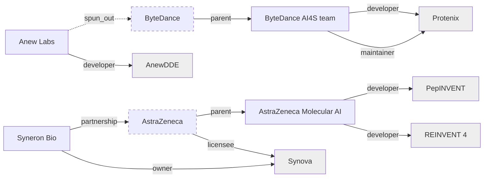

# Lineage

```mermaid
flowchart LR
    e0["Anew Labs"]
    e1["AstraZeneca"]:::stub
    e2["AstraZeneca Molecular AI"]
    e3["ByteDance"]:::stub
    e4["ByteDance AI4S team"]
    e5["Syneron Bio"]
    a0["AnewDDE"]:::asset
    a1["PepINVENT"]:::asset
    a2["Protenix"]:::asset
    a3["REINVENT 4"]:::asset
    a4["Synova"]:::asset
    e0 -.->|"spun_out"| e3
    e1 -->|"parent"| e2
    e3 -->|"parent"| e4
    e5 -->|"partnership"| e1
    e0 -->|"developer"| a0
    e1 -->|"licensee"| a4
    e2 -->|"developer"| a1
    e2 -->|"developer"| a3
    e4 -->|"developer"| a2
    e4 -->|"maintainer"| a2
    e5 -->|"owner"| a4
    classDef stub stroke-dasharray: 5 5
    classDef asset fill:#eeeeee
```
