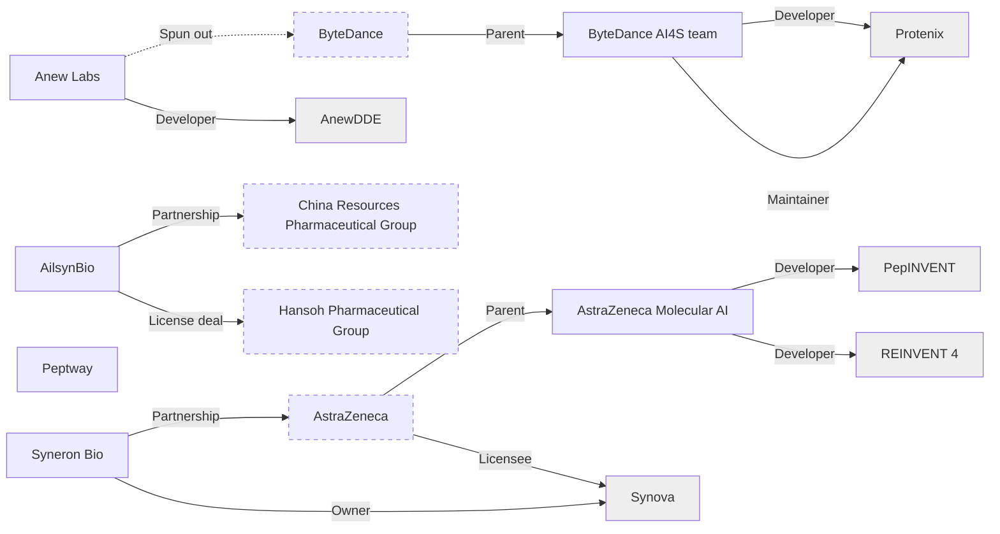

# Lineage

[← Home](../README.md) · [Types](by-type.md) · [Status](by-status.md) · [Modalities](by-modality.md)

```mermaid
flowchart LR
    e0["AilsynBio"]
    e1["Anew Labs"]
    e2["AstraZeneca"]:::stub
    e3["AstraZeneca Molecular AI"]
    e4["ByteDance"]:::stub
    e5["ByteDance AI4S team"]
    e6["China Resources Pharmaceutical Group"]:::stub
    e7["Hansoh Pharmaceutical Group"]:::stub
    e8["Peptway"]
    e9["Syneron Bio"]
    a0["AnewDDE"]:::asset
    a1["PepINVENT"]:::asset
    a2["Protenix"]:::asset
    a3["REINVENT 4"]:::asset
    a4["Synova"]:::asset
    e0 -->|"Partnership"| e6
    e0 -->|"License deal"| e7
    e1 -.->|"Spun out"| e4
    e2 -->|"Parent"| e3
    e4 -->|"Parent"| e5
    e9 -->|"Partnership"| e2
    e1 -->|"Developer"| a0
    e2 -->|"Licensee"| a4
    e3 -->|"Developer"| a1
    e3 -->|"Developer"| a3
    e5 -->|"Developer"| a2
    e5 -->|"Maintainer"| a2
    e9 -->|"Owner"| a4
    classDef stub stroke-dasharray: 5 5
    classDef asset fill:#eeeeee
```
